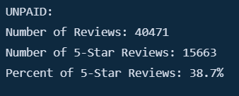

# Amazon Vine Analysis

## Overview

This project analyzed an Amazon dataset regarding reviews of video games in order to determine if Amazon Vine members are biased towards favorable reviews. 

### Purpose

Amazon Vine is a service whereby businesses can pay a fee and provide products to members, who must then publish a review. This allows businesses, such as SellBy, to enusre their products have reviews. This analysis seeks to determine whether members of Amazon Vine are biased towards giving positive reviews, which can help guide SellBy's marketing strategy in the future.

## Results

### Paid Reviews

As seen below:
- There were only 94 paid reviews in the dataset. This is incredibly small compared to unpaid reviews but can still provide SellBy with information on potential bias.
- Of the 98 paid reviews, a whopping 48 of them were 5-star reviews - the highest rating possible.
- In turn, 51.1% of all paid reviews were 5-stars.

### Unpaid Reviews

As seen below:
- The vast majority of reviews (40,471) were unpaid.
- Of the 40,471 reviews, only 15.663 of them were 5-star reviews.
- Therefore, only 38.7% of all reviews are 5-star.

## Summary

### Conclusions

Based on these results, it is our belief that Amazon Vine members are biased towards favorable reviews. While it is clear that choosing ratings are non-random for both groups (38.7% and 51.1% of all unpaid and paid reviews are rated 5-star, which is much higher than the 20% we would expect if it was random), and while we only have a small sample of paid reviewers relative to unpaid ones, it is quite apparent that Amazon Vine members are biased, as we would assume similar rates of rating items 5-stars if the populations were the same.

### Further Analysis

While it already appears clear that Amazon Vine members are biased towards favorable reviews, additional analysis is recommended to support the results. Although over half of all paid reviews are 5-stars, that does not mean the other half are necessarily much lower. To adequately determine whether they're biased or not, we recommend graphing each population's (paid and unpaid reviews) distribution of star ratings. If paid reviewers are biased toward favorable reviews, they will tend to give higher star ratings, even if they haven't given a 5-star rating. 

Additionally, we suggest running statistical analyses (t-test, etc.) in order to compare the mean rating for each population. This can give us a quantifiable metric that we can use to determine if the average ratings are different between the two populations.

